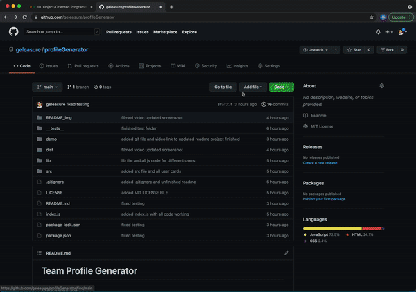

# Team Profile Generator

## Description 

*A summary of what this project is, and why it has been created:*

This project is built using JavaScript Object Orientated Programming considerations. <br> It automates the creation of a formatted index.html containing a teams' profile cards via a series of prompts / questions that the end user is required to provides responses to. <br> The prompts are questions relating to the building of a team comprising of a <br> A Manager. <br> Engineers'. <br> Interns'. <br> The output is a file named ```index.html```, which is a webpage that conatins a series of cards relating to the answers the end user supplies to each question. <br><br> 

<br>

[](https://opensource.org/licenses/MIT)

---

<br>


## Table of Contents       
   * [Installation](#installation)
   * [Usage](#usage)
   * [Contributing](#contributing)    
   * [Tests](#tests)    
   * [License](#license)
   * [Questions](#questions)
---

<br>

## Installation

*How to install this project:*

You can either clone this repository to a local directory or you can fork this repository from within GitHub. <br> The [Usage](#usage) section also has a video that covers how to install the project as well as how to use it.

 
---

<br>

## Usage 

*How to use this project:*

Once the repository has been locally copied via either of the previous methods, then from bash shell and within the working directory you will need to install the ```inquirer``` module using the following command: <br><br> ```npm i inquirer``` <br><br> Then you will need to execute the following command: <br><br> ```node index.js``` <br><br> The from which you will be prompted for answers to a series of questions/prompts, after providing responses to the questions, the index.html file will be created in the directory named ```dist```. <br> <br> For a more detailed explanation please use the below link to view the video on how to do this: <br><br> Click this link to access the video: [Demonstration Video](https://youtu.be/-9_rYwq7uSY) <br> <br>


---

<br>

## Contributing

*If you like what you see and you would like to contribute, here's how you can:*

Contributing is welcome and easy. <br> If you like the project and feel you would like to either add to it or you would like to improve on it in anyway, please contact me via the [Questions](#questions) section below. <br> I will then be more than willing to give you access to collaborate. <br>You can also take a copy via the fork feature of GitHub and work on this project without collaboration if you wish.

 
---

<br>

## Tests

*Tests that have been run, and how to run them:*

There are test files to accompany the constructor object class files. Tests have been run using ```jest``` and all succesfully pass. After installing ```jest``` by using the following command: <br><br> ```npm install --save-dev jest``` <br><br> you can run the following jest command to initiate the jest tests:
```npm test```

---

<br>

## License

*The following license has been applied to this project:*

MIT License - for more detail [Visit Site](https://opensource.org/licenses/MIT)


---

<br>

## Questions?

*For any questions regarding this project, please use either of the below contact details:*

GitHub: [geleasure](https://github.com/geleasure)

Email: geleasure@gmail.com


---

<br>

## Copyright

© 2021 - Grant Leasure - Studying & working hard towards becoming a competent developer. 

